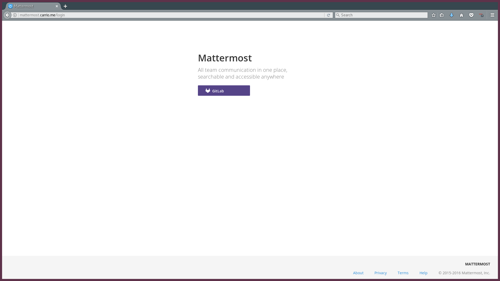

# DOSR Stack

```bash
# Fun fact, this README.md was generated with the following command:
cat Introduction.md \
	{dosr-sql,dosr-web,gitlab,mattermost,postgres,nginx,s3-backups,screenshots,dosr-installation}/README.md | \
	sed "s/DOSR](screenshots//DOSR](screenshots/screenshots\//g" > README.md
# All components also have their own README.md describing their function, design, etc.
```

By Thomas Carrio and Chase Ehlert

### Introduction to the Project and README.md

The contents of this submission include all relevant services pertaining to the DOSR stack. Each directory comprises of that component of our service, such that `gitlab` contains the configuration file for GitLab, `postgres` contains database dumps of our working databases, and so on. 

The project scope was to create a software-as-a-service with Gitlab and Mattermost, providing further functionality with tools such as CI, SSO, LDAP integration, Webhooks, and more. The finished product included GitLab CE, Mattermost, Webhook and SSO intergration between them, an AWS cluster of GitLab Runners for building pipelines with GitLab CI, Slash commands from Mattermost to control and query GitLab, cloud-based backups of our configuration files and databases, and LDAP integration with our existing `cit349.ou` domain. The following table of contents outlines the purpose of each directory found in this submission:

1. [dosr-sql](#dosr-sql)
2. [dosr-web](#dosr-web)
3. [GitLab Configuration](#gitlab-configuration)
4. [Mattermost Configuration](#mattermost-configuration)
5. [PostgreSQL Dumps](#postgresql-dumps)
6. [Nginx Configuration](#nginx-configuration)
7. [S3 Backups](#s3-backups)
8. [Service Screenshots](#service-screenshots)
9. [Installation Guide](#installing-a-stack-like-dosr)


### dosr-sql

These scripts were used for generating the database tables and filling them with the data for our website. They are basic SQL scripts with PostgreSQL-specific syntax. 

### dosr-web

It's based on the Flask microframework and hooks into the database using the psyconpg2 module for Python. 

The Python modules can be installed using the "requirements.txt" file using the command:

`pip install -r requirements.txt`

The service is best run by creating a `virtualenv` folder to isolate Python modules from a global installation. The `wsgi.py` file utilizes Gunicorn, a WSGI compliant HTTP server, and is accessible via a Unix socket saved to the running directory. The systemd unit file allows the web app to be handled by Ubuntu's service system. Nginx is configured as a reverse proxy to serve HTTP traffic on port 80, passing communication to the Unix socket. 

### GitLab Configuration

The `gitlab.rb` file dictates all configuration settings for the GitLab CE server. 

After installing per our installation guide this configuration file is used for configuring all services. 

This can be done using `gitlab-ctl reconfigure`.

### Mattermost Configuration

The `config.json` file is used for the initial settings of Mattermost. Further configurations can be made within the admin panel for user-friendly access, but all changes are saved to the database or `config.json` file. 

This configuration file can be used with a bare install of Mattermost. Ours has been specifically modified to allow for Single Sign-On access from GitLab. Set the FQDN's accordingly for each service if setting up for yourself. 


### PostgreSQL Dumps

These are the database dumps of our services. I have included the following, which are found at their respective names in `.sql` files:

1. GitLab -> gitlabhq_production.sql
2. Mattermost -> mattermost.sql
3. DOSR webpage -> dosrdb.sql

These can be imported directly into PostgreSQL either in a terminal using the command:

```
\i $filename.sql
``` 

or with the `psql` command using 

```bash
psql -f $filename.sql
```

### Nginx configuration

The nginx service was configured as a reverse proxy for all of our services offered. I had a DNS entry created for every service such that nginx could identify requests to the server by the URL and pass requests to the corresponding service. 

None of the services require odd ports, and are all available under the same machine at port 80 using basic HTTP. The last rule in the configuration file is setup to ward off traffic snoopers and unwarranted traffic. Requests using the specific fully-qualified domain names are passed. Other requests are blocked and a 404 returned. 

### S3 Backups

The S3 backups makes use of the `aws-cli` utility. Using the access token and ID provided when creating an S3 bucket, this utility can recursively copy entire directories to AWS. 

The Glacier service is a low-IO backup service whose purpose is for storing files which will likely not be needed again. For a long-term backup solution of outdated data for the span of 2-3 years past backup date, this service is great for a low-cost and integrated cloud backup solution. 

The S3 bucket is versioned in order to allow record of changes to our backup files, and outdated versions are migrated to the Glacier service since their storage on the S3 service is unnecessary spending.  This is configured through the AWS Console online. 

The `pg_dump` utility is used for generated SQL files of the databases for our services. The `s3.sh` script uses the `aws-cli` utility to backup GitLab, Mattermost, DOSR webapp, and their databases SQL files which were dumped. These are all pushed to indepdendent folders under the S3 bucket for easy location and recovery to the correct folders. Restoring a configuration of mattermost, the `s3://$bucket/mattermost/` directory reflects the same folder structure as the root of the Ubuntu server the Mattermost server runs on, such that `opt/mattermost/config/config.json` is the same under that directory in S3 as `/` on Ubuntu. 


### Service Screenshots


The DOSR webapp homepage


The Project Spec section our web page.


Our beautiful section on the system administrators involved in the project!


The welcome page of our GitLab! Customized to handle LDAP authentication and with instructions for how to log in.


2 Factor Authentication is also available for GitLab accounts. 


Here's a view of a full git repository on our GitLab service.


That project has a `.gitlab-ci.yml` file! Here's our AWS Runner cluster hard at work testing these Linux builds of Minetest.


You can create Groups in GitLab, which made coordination of our codebase and overall project much simpler for our team.


And you can create Issues on existing projects! This one is an example that shows an Assignee, commit references, and later, automatic webhooks demonstrated on Mattermost.



Welcome to Mattermost! The only way you can access this service is with your GitLab account. If you're registered and logged in already, it'll automatically plug you right in!


Here's one of our chat channels concerning our `dosr-sql` project. This displays our automatic updates on issues created on our GitLab project. 


Some more messages hooked from GitLab showing push updates and closed issues concerning our `dosr-web` project. 


Our Admin Page, showing statistics on projects, features, components, and more. Sadface, only the professor tested our service `:(`. 


Heading to the Jobs tab on the Admin Page shows info on the current jobs that are queued, finished, or running on our service! I spun up builds of several projects to demonstrate.


And taking a look at the Runners actually installed! Once the AWS cluster was configured and confirmed to work, the local Runners were disabled for security and performance reasons. Isolated environments for building and more resources dedicated to our SaaS servers!


And a test from home, showing GitLab pushing working from my desktop. Don't mind the number of resolutions mentions in that neofetch `¯\_(ツ)_/¯` .


# Installing a Stack like DOSR

### Table of Contents

1. [PostgreSQL](#postgresql)
2. [GitLab CE](#gitlab-ce)
3. [Mattermost](#mattermost)
4. [Single Sign-On](#sso-for-mattermost-with-gitlab)
5. [GitLab CI](#gitlab-ci)
6. [Gitlab-Mattermost Integration](#gitlab-mattermost-communication)
7. [Web Stuff](#web-stuff)
8. [Summary](#summary)


Each of these are necessary for the main functionality of DOSR. GitLab provides the means of handling version control, team development, issues, pull requests, and more, tied to a single platform. The Community Edition is free and open source and can be installed on Ubuntu 16.04 by following the instructions here [1]. The Mattermost server is free and open source and can be installed on Ubuntu 16.04 by following the instructions here [2]. GitLab CI can be enabled by installing and registering a GitLab Runner to the GitLab server. The instructions for installing a Runner on Ubuntu 16.04 can be found here [3]. PostgreSQL was chosen since it can be connected to every service required for DOSR, and can be installed on Ubuntu 16.04 or Windows using the instructions here [4]. 

### An In Depth Look

Of course, there's more to each step than just copy some commands and run it. For the functionality provided by the DOSR service, further configuration, installation, and troubleshooting was undertaken before such a fine display of perfectly interconnected services could be made. To start from the top, we'll get PostgreSQL going now in order to have the database available for our services. We'll assume that the server(s) hosting GitLab, Mattermost, and Postgres will have unique FQDN's prior to this setup. For now, they'll be referred to as `$gitlab-fqdn`, `$mattermost-fqdn`, and `$postgres-fqdn`.

### PostgreSQL

The guide provided in references provides instructions for installing PostgreSQL, or Postgres for sake of saving my fingers from reach for that Shift key so often, on Windows and Ubuntu. The installation for Windows is relatively straightforward with a downloadable installer. The Ubuntu guide is vastly more difficult and contains the following:

```bash
apt-get install postgresql postgresql-contrib
```

Yikes, that was hard. Follow any prompts given when installing Postgres for the first time. The `psql` interactive terminal for Postgres will be visited multiple times throughout this installation guide, so remember which server you have Postgres installed to, and how to identify it with `psql`. Pgadmin is a GUI tool for accessing from Windows. The following `psql` command should connect you into an interactive terminal with your Postgres server, however there are some syntactical differences when done through Windows, such as calling the `psql.exe` command from the command line and providing Windows specific syntax. 

```bash
psql -h $hostname -U $username -d $database
```

A password, if required, will be prompted for after connection. Make sure you have your firewalls available! The Postgres uses TCP on 5432 by default. On Ubuntu, simply running

```bash
ufw allow 5432
```

and your firewall will allow external access to your database. Remember, **only open ports that need to be accessed from outside the current server**. Lastly, make sure, if that external access is configured if you need it. Edit the `postgresql.conf` file under `/etc/postgresql/$version_no/main/` and set `listen_addresses` to `'*'`.  Test external access now. If you still cannot access, you may need to modify `/etc/postgresql/9.3/main/pg_hba.conf` to include all IP address of the external server. This can be done by including the line(s):

```
host all all $external_ip/32 md5
```

for all `$external_ip`'s  that may need to access your server, such as `$mattermost_fqdn` and `$gitlab_fqdn`. 

Now that we have Postgres installed, the firewall and access configured, let's move on to the services using it. 

### GitLab CE

Make sure to have all dependencies downloaded

```bash
sudo apt-get install curl openssh-server ca-certificates postfix
```

Now, add the GitLab package server and install the `gitlab-ce` package

```bash
curl -sS https://packages.gitlab.com/install/repositories/gitlab/gitlab-ce/script.deb.sh | sudo bash
sudo apt-get install gitlab-ce
```

Before running the configuration script on GitLab, make some modifications to the `/etc/gitlab/gitlab.rb` file. Namely, the following should be focused right now to get the service up and running. This configuration file contains rules for SMTP, LDAP, Postgres, and more. The following settings should be made, and for the following purposes:

```ruby
# the URL GitLab will use for external references (ssh/https cloning, etc.)
external_url '$gitlab-fqdn'
# LDAP configuration
gitlab_rails['ldap_enabled'] = true
gitlab_rails['ldap_servers'] = YAML.load <<-'EOS'
  main: # 'main' is the GitLab 'provider ID' of this LDAP server
     label: 'LDAP'
     host: '141.210.25.110'
     port: 389
     uid: 'sAMAccountName'
     method: 'plain' # "tls" or "ssl" or "plain"
     bind_dn: 'CN=Thomas Carrio,OU=dosr,OU=OU,DC=cit349,DC=ou'
     password: 'redacted'
     active_directory: true
     allow_username_or_email_login: true
     block_auto_created_users: false
     base: 'OU=OU,DC=cit349,DC=ou'
     user_filter: ''
     attributes:
       username: ['uid', 'userid', 'sAMAccountName']
       email:    ['mail', 'email', 'userPrincipalName']
       name:       'cn'
       first_name: 'givenName'
       last_name:  'sn'
EOS
# PostgreSQL connection
gitlab_rails['db_adapter'] = "postgresql"
gitlab_rails['db_encoding'] = "utf8"
gitlab_rails['db_collation'] = nil
gitlab_rails['db_database'] = "gitlabhq_production"
gitlab_rails['db_pool'] = 10
gitlab_rails['db_username'] = "postgres"
gitlab_rails['db_password'] = "redacted"
gitlab_rails['db_host'] = '$postgres_fqdn'
gitlab_rails['db_port'] = 5432
gitlab_rails['db_socket'] = nil
gitlab_rails['db_sslmode'] = nil
gitlab_rails['db_sslrootcert'] = nil
gitlab_rails['db_prepared_statements'] = true
gitlab_rails['db_statements_limit'] = 1000
# Internal nginx configuration and host port
nginx['enable'] = true
nginx['listen_port'] = 8000 # or 80, this was due to reverse proxy setup on single server
```

The configurations concern how the GitLab generates its URLs, how it interfaces with LDAP, how to connect to the database, and which port to host the service on.  The default configurations for GitLab will also spin up several services internally that you must make sure not to conflict any ports with, such as Unicorn on 8080 and Redis on 6379. 

Once configuration is complete, you can configure the GitLab CE service using

```bash
gitlab-ctl reconfigure
gitlab-ctl restart
```

If there are any issues getting the reconfigure to work, a sequence of `stop`, `start`, `stop` has been documented as helping resolve it in some cases. 

Now that GitLab has been configured it's time to get started on Mattermost.

### Mattermost

First off, we need to setup a new user in Postgres and database with them as the owner so we can connect them. Use `psql` to connect to your Postgres server and perform the following:

```sql
CREATE DATABASE mattermost;
CREATE USER mmuser WITH PASSWORD 'mmuser_password';
GRANT ALL PRIVILEGES ON DATABASE mattermost TO mmuser;
\q
```

You should now have a new Postgres database called `mattermost` with a user `mmuser` who has all privileges to it. They can create tables, insert or select or anything on it. They're god of mattermost. Let's keep going.

You will download a tarball of the Mattermost release and extract it to `/opt`. Perform the following:

```bash
wget https://releases.mattermost.com/X.X.X/mattermost-X.X.X-linux-amd64.tar.gz
tar -xvzf mattermost*.gz
sudo mv mattermost /opt
sudo mkdir /opt/mattermost/data
```

Next we'll need to configure the user that will run the service and set their permissions on the Mattermost folder accordingly. 

```bash
sudo useradd --system --user-group mattermost
sudo chown -R mattermost:mattermost /opt/mattermost
sudo chmod -R g+w /opt/mattermost
```

After this, the database connection to Postgres can be setup. Edit the config file `/opt/mattermost/config/config.json` and modify the `SqlSettings` section as per the following, and the `ServiceSettings` section while we're in there:

```json
"ServiceSettings": {
        "SiteURL": "http://$mattermost_fqdn",
        "ListenAddress": ":8065" // or whatever port you choose
// ...
}
//...
"SqlSettings": {
       "DriverName": "postgres",
       "DataSource": "postgres://mmuser:mmuser_password@$postgres_fqdn:5432/mattermost?sslmode=disable\u0026connect_timeout=10",
       "DataSourceReplicas": [],
       "MaxIdleConns": 20,
       "MaxOpenConns": 300,
       "Trace": false,
       "AtRestEncryptKey": "cif0mzk408esqlr0us12dwlm8ag4ood0"
    }
```

The Mattermost service can be manually started with the executable `platform` located under `/opt/mattermost/bin`. Test this works with `sudo -u mattermost /opt/mattermost/bin/platform`. The server should begin listening on port 8065 if successful. 

However, this isn't the optimal manner of running the service. Ubuntu uses systemd for managing services. The following systemd unit file can be used for managing the Mattermost service with `systemctl start/stop/restart/status mattermost`. Create the file `/lib/systemd/system/mattermost.service` and fill it with the following contents:

```bash
[Unit]
Description=Mattermost
After=network.target
After=postgresql.service
Requires=postgresql.service

[Service]
Type=simple
ExecStart=/opt/mattermost/bin/platform
Restart=always
RestartSec=10
WorkingDirectory=/opt/mattermost
User=mattermost
Group=mattermost
LimitNOFILE=49152

[Install]
WantedBy=multi-user.target
```

This will be available after reloading the daemon with `systemctl daemon-reload`. Check the status with `systemctl status mattermost`, and launch it with `systemctl start mattermost`.  Check it by accessing the site [http://$mattermost_fqdn](). Register an account, this will be the admin user on the Mattermost server. The rest is simply configuring SMTP, TLS, etc. from the web console as this admin user, which you can follow here [5]. 

### SSO for Mattermost with GitLab

Logged into GitLab as the admin account, you can go to User Settings (not the Admin Panel), and Applications. Here you can give a name "Mattermost", and redirect URIs in the form

```
http://$mattermost_fqdn/login/gitlab/complete
http://$mattermost_fqdn/signup/gitlab/complete
```

Grant it read_user privilege and you save the application. You will need to open up the generated application and get the `Application ID` and `Secret` to configure Mattermost with. Modify the `/opt/mattermost/config/config.json` file again, and make the following changes to the section

```json
"GitLabSettings": {
        "Enable": true,
        "Secret": "a3046374633b5882f72558c796077f483315ac170ba753aa1a6ca607c534bc45",
        "Id": "42ade2f3c4c5cd6bd03446e5b142137b6de3bb838e836b93084ec91174a7ede2",
        "Scope": "read_user",
        "AuthEndpoint": "http://$gitlab_fqdn/oauth/authorize",
        "TokenEndpoint": "http://$gitlab_fqdn/oauth/token",
        "UserApiEndpoint": "http://$gitlab_fqdn/api/v3/user"
    }
```

*Boom, done.* Mattermost can now use valid GitLab sessions for logging in. 

### GitLab CI

For the GitLab CI functionality, we will need at least one Runner for our service. To set up a GitLab Runner, a server will need to be configured and registered against our GitLab. For an Ubuntu 16.04 server, we can quickly install Docker for containerized builds first. 

```bash
curl -sSL https://get.docker.com/ | sh
```

Now to setup the Runner, we will first need a token from the GitLab server. Login as an admin and go to the Runners tab of the Admin panel. The `$runner_token` should be in red font. You can regenerate this at any time. Copy this for the Runner registration.

```bash
curl -L https://packages.gitlab.com/install/repositories/runner/gitlab-ci-multi-runner/script.deb.sh | sudo bash
sudo apt-get update
sudo apt-get install gitlab-ci-multi-runner
sudo gitlab-ci-multi-runner register # this will prompt for many things
# GitLab Cordinator: $gitlab_fqdn
# GitLab Token :  $runner_token
# Description:  dosr-test-runner
# Executor?  "docker" if installed, otherwise "shell" works fine
# Enter docker image: "ruby 2.1" is a good start
```

This should register the Runner as a Shared Runner for all GitLab users. Any time a Pipeline is entered and builds start, the builds will use this Runner for building. Docker is considered the safer and standard executor, since containerized environments provide a jail for potentially malicious code. It is **not suggested** you run the GitLab Runner on the same machine as your GitLab server, or any sensitive server. For example, our GitLab Runners are orchestrated Ubuntu 16.04 instances on AWS which allow any issues in the system to be reverted back to a prior working image. 

### GitLab<->Mattermost Communication

After creating your team on Mattermost you can invite members from GitLab. Mattermost users must be linked from GitLab before invitation, Mattermost cannot and will not access the GitLab database for users. Once you login to Mattermost, user invitations are available for that user.  Public teams can also be made for others to join if they would like. 

A good way of hooking features from GitLab to Mattermost is to create Webhooks between your Team and a project on GitLab. Mattermost offers an easier alternative to this as well, with their "Slash commands". A slash command allows a command to be run from the Mattermost chat, such as `/minetest-runner`, and specific commands after that, in order to perform actions on them. 

First, create the Slash command in your GitLab project. The "Request URL" will be used for the Mattermost server to hook them together. After creating it in GitLab, the generated data can be copied to to the "Add Slash Command" form in Mattermost. This guide details more on the process [6].

### Web Stuff

This webpage was considered very minimal, since the rest of our service is provided over the web as well. Its only requirements are to provide info and access to our offered services. Due to this, a Flask application was developed which connects to a database on our Postgres server. The data is pulled, and passed to a Jinja template which is rendered and returned to the user. The built-in Flask server is only used for development purposes, so we took the liberty of implementing a more robust reverse proxy system with gunicorn and Nginx as well. Setting up Nginx for providing each service, especially where they are all provided under the same server, is helpful for providing a user friendly interface to each service. Forcing non-standard ports onto these services only makes for ugly and long hyperlinks. The following details how the Nginx server was configured to allow GitLab, Mattermost, and gunicorn to run under a single port with a reverse proxy. The existence of distinct fully-qualified domain names is required for managing this without route and request modifications. 

Install Nginx on Ubuntu 16.04 with the following commands:

```bash
sudo apt-get update
sudo apt-get install nginx
sudo ufw app list
```

Confirm that the list of apps includes "Nginx Full" and "Nginx HTTP" for this process. That means that Nginx has been installed with a firewall rule to allow TCP traffic on 80.  With this finished, we can lay down some starting points. 

Using our services as an example, each service has its own FQDN, and are setup as the following:

1. GitLab CE = gitlab.carrio.me = $gitlab_fqdn
2. Mattermost = mattermost.carrio.me = $mattermost_fqdn
3. gunicorn = dosr.carrio.me = $website_fqdn

A configuration needs to be made in the `/etc/nginx/sites-available/` folder. For ours, we made one called `dosr`. A server needs to be added for each service running on this server.  The structure is easy with only a proxy pass to our internal services, but each requires a `server` block, as such:

```nginx
# dosr webpage
server {
        listen 80;
        server_name $website_fqdn;

        location / {
                include proxy_params;
                proxy_pass http://unix:/opt/dosr-web/dosr.sock;
        }
}
# gitlab
server {
        listen 80;
        server_name $gitlab_fqdn;

        location / {
                include proxy_params;
                proxy_pass http://127.0.0.1:8000;
        }
}
# mattermost
server {
        listen 80;
        server_name $mattermost_fqdn;

        location / {
                include proxy_params;
                proxy_pass http://127.0.0.1:8065;
        }
}
```

Make sure to set the `proxy_pass` line to the correct `address:port` for each service. This allows each service to be accessed at their respective FQDN while all being hosted under the same port. In this manner, no routes needs to be configured and you can quickly push each service online under a valid HTTP port.  

Another useful configuration in this portion of the project is to set up IP-access denial in Nginx. This configuration makes it so the services can **only** be accessed at their FQDN, and any requests for the specific IP address of our server will immediately 404. This is helpful in deterring DDOS attack and potential exploits of our services. This can be added to our `dosr` config by appending the following block:

```nginx
# default
server {
        listen 80 default_server;
        return 404;
}
```

### Summary

And there it is! We have GitLab CE, CI, Runners, Mattermost, SSO, LDAP, SMTP, Webhooks, Docker, and PostgreSQL. In fact, our service did take it farther than this, implementing an AWS cluster for our GitLab Runners, S3/Glacier for our short-term / long-term backups of configuration and database data, and docker-in-docker execution for Runners. There's plenty more to add onto this and overall the service is openly accessible to all our peers both on and off campus. Git gud. 

### References:

1. https://about.gitlab.com/downloads/#ubuntu1604
2. https://docs.mattermost.com/install/install-ubuntu-1604.html
3. https://docs.gitlab.com/runner/install/linux-repository.html
4. https://www.postgresql.org/download/
5. https://docs.mattermost.com/install/install-ubuntu-1604.html#configuring-mattermost-server
6. https://docs.gitlab.com/ce/user/project/integrations/mattermost_slash_commands.html
