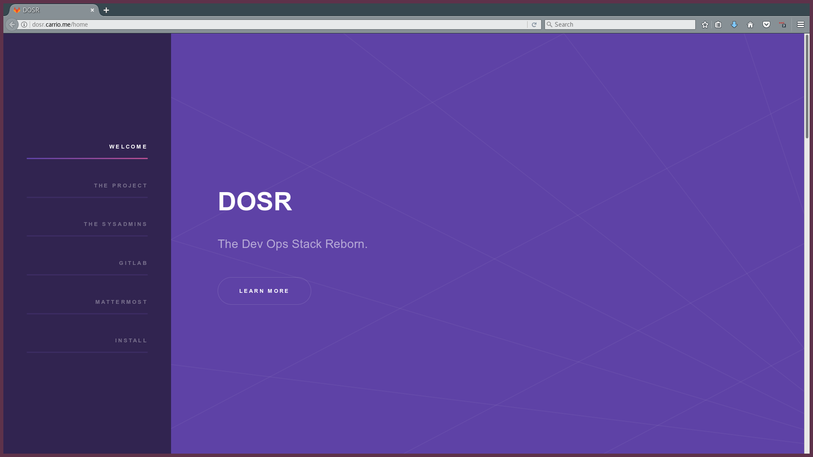
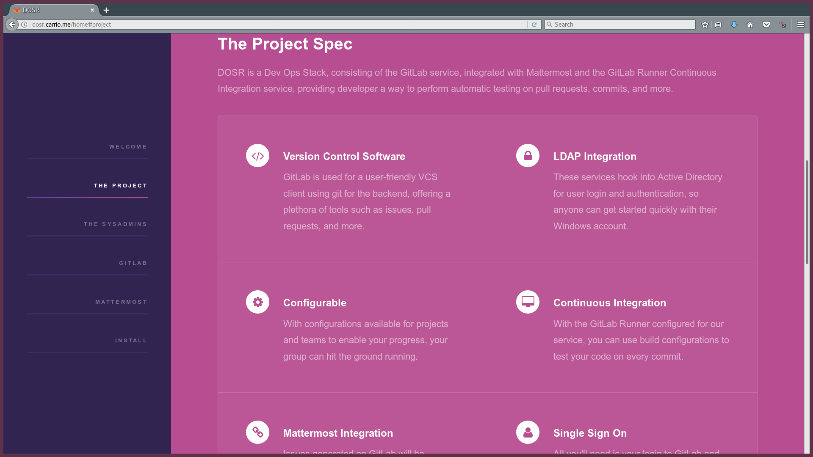
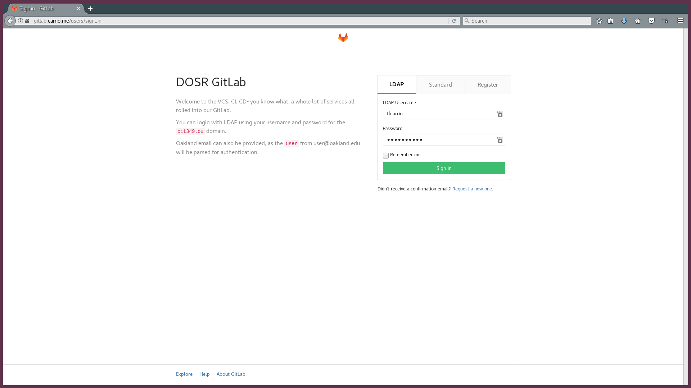
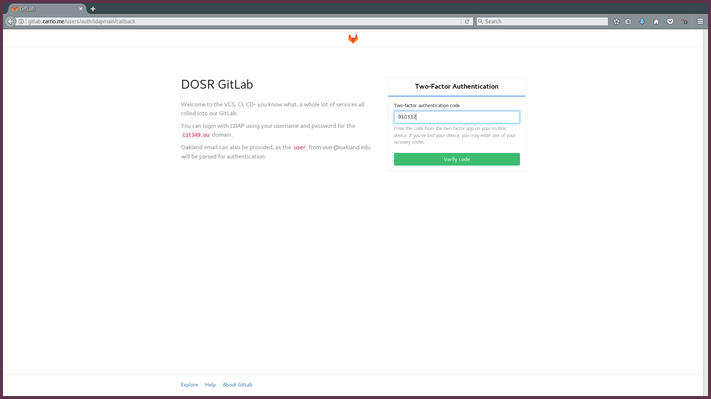
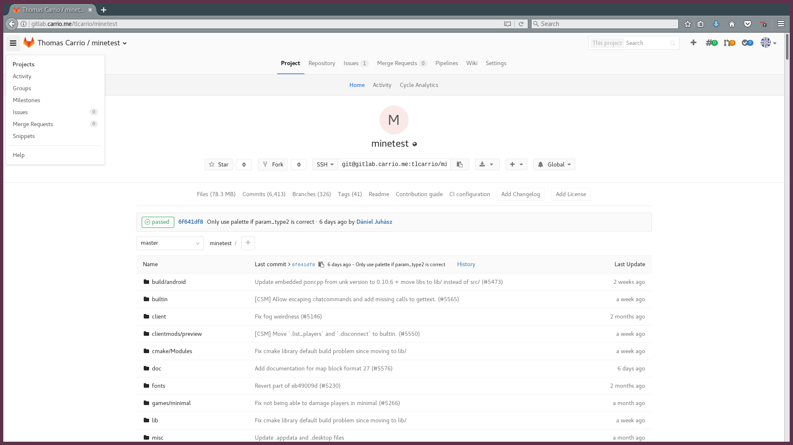
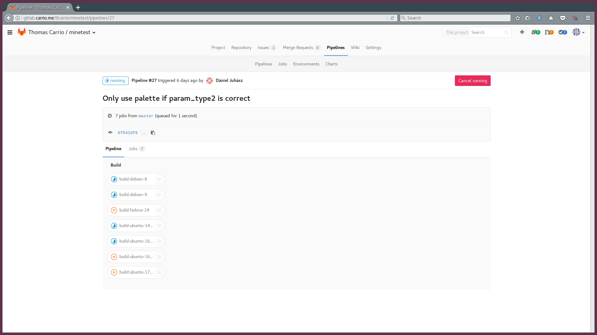
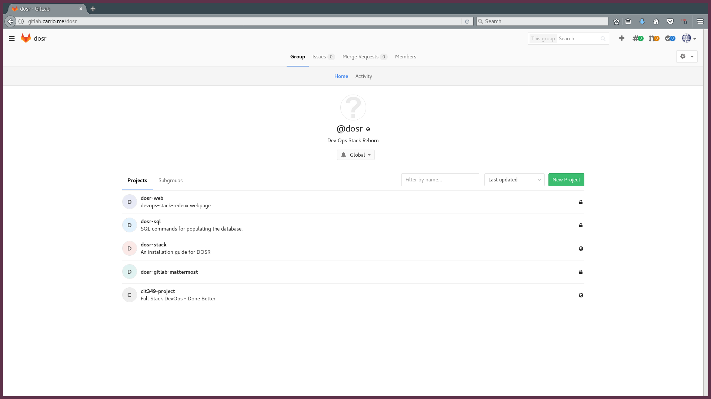
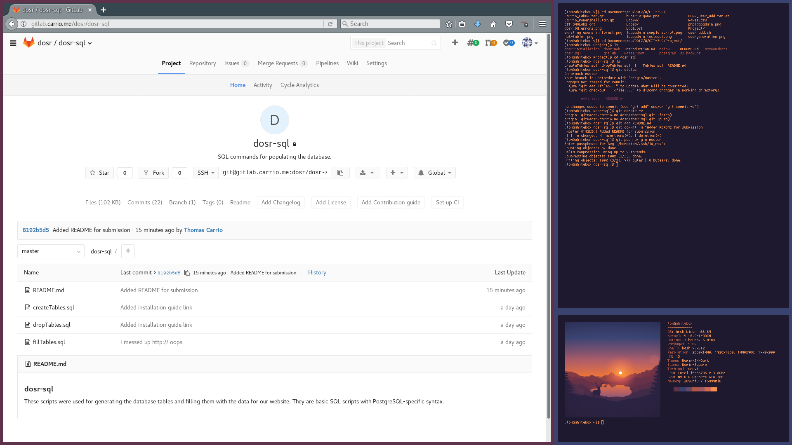

### Service Screenshots

The DOSR webapp homepage

The Project Spec section our web page.

Our beautiful section on the system administrators involved in the project!

The welcome page of our GitLab! Customized to handle LDAP authentication and with instructions for how to log in.

2 Factor Authentication is also available for GitLab accounts. 

Here's a view of a full git repository on our GitLab service.

That project has a `.gitlab-ci.yml` file! Here's our AWS Runner cluster hard at work testing these Linux builds of Minetest.

You can create Groups in GitLab, which made coordination of our codebase and overall project much simpler for our team.

And you can create Issues on existing projects! This one is an example that shows an Assignee, commit references, and later, automatic webhooks demonstrated on Mattermost.

Welcome to Mattermost! The only way you can access this service is with your GitLab account. If you're registered and logged in already, it'll automatically plug you right in!

Here's one of our chat channels concerning our `dosr-sql` project. This displays our automatic updates on issues created on our GitLab project. 

Some more messages hooked from GitLab showing push updates and closed issues concerning our `dosr-web` project. 

Our Admin Page, showing statistics on projects, features, components, and more. Sadface, only the professor tested our service `:(`. 

Heading to the Jobs tab on the Admin Page shows info on the current jobs that are queued, finished, or running on our service! I spun up builds of several projects to demonstrate.

And taking a look at the Runners actually installed! Once the AWS cluster was configured and confirmed to work, the local Runners were disabled for security and performance reasons. Isolated environments for building and more resources dedicated to our SaaS servers!

And a test from home, showing GitLab pushing working from my desktop. Don't mind the number of resolutions mentions in that neofetch `¯\_(ツ)_/¯` .

